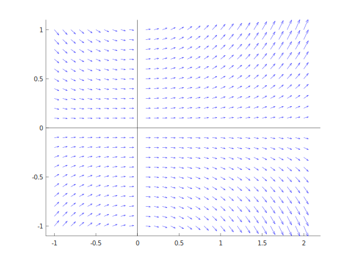
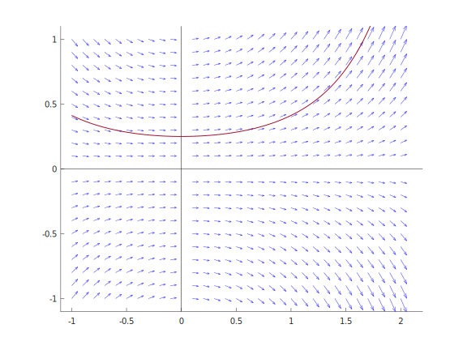
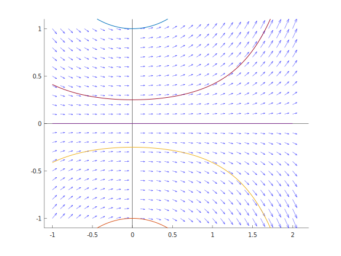
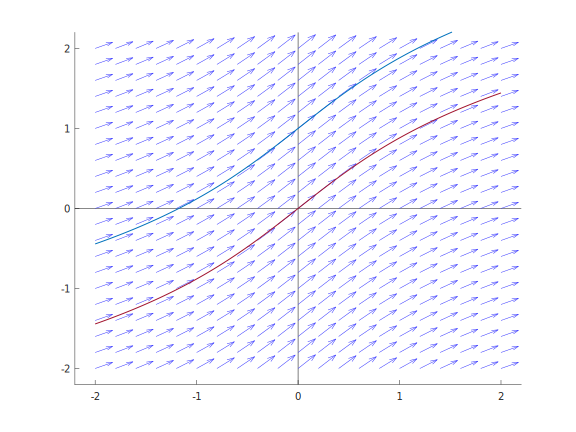

# Differential equations helpers

A collection of helper functions/scripts/procedures related to differential equations

#### Plot direction field and a function

This MATLAB/OCTAVE function is used for plotting direction field and explicit functions on the same graph. It is a particularly handy procedure for checking a solution to a first order differential equation by graphically checking if proposed solutions align with slope vectors. See `plotDirectionFieldAndFunction.m` for further documentation.

Usage:

```matlab
% Plotting only direction field
[quiv, fig] = plotDirectionFieldAndFunction([-1 0.1 2], [-1 0.1 1], @(x, y) x.*y)
```


```matlab
% Plotting with an explicit function
[quiv, fig] = plotDirectionFieldAndFunction([-1 0.1 2], [-1 0.1 1], @(x, y) x.*y, @(x) 0.25*e.^((x.^2)./2))
```


```matlab
% Plotting with more than one explicit function
[quiv, fig] = plotDirectionFieldAndFunction([-1 0.1 2], [-1 0.1 1], @(x, y) x.*y, 
    {@(x) 0.25*e.^((x.^2)./2), @(x) e.^((x.^2)./2), @(x) (-1)*e.^((x.^2)./2), @(x) (-0.25)*e.^((x.^2)./2), @(x) 0*e.^((x.^2)./2)})
```


```matlab
% Plotting and saving figure to a file
% this code saves the created figure to a file called arcsinh-de.pdf 
[quiv, fig] = plotDirectionFieldAndFunction([-2 0.2 2], [-2 0.2 2], @(x, y) 1./sqrt(1+x.^2), 
    {@asinh, @(x) asinh(x)+1}, 'arcsinh-de.pdf')
```


